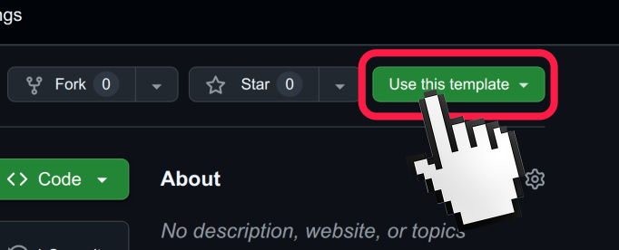

# Industrial IoT Portfolio – Template Repository

> A student portfolio template for the 18-week Diploma of Information Technology – Internet of Things course.
> 
> **This is a template repository.** Click "Use this template" to create your own portfolio repo.




---

##  Course Overview

This portfolio documents your journey through an 18-week IoT course:

| Phase | Weeks | Assessment | Focus |
|-------|-------|-----------|-------|
| **Electronics** | 1–9 | A1–A4 | Sensors, actuators, circuits, data collection |
| **AWS Cloud** | 10–14 | A5, A5b | IoT Core, device management, analytics, dashboards |
| **Capstone** | 15–18 | A6 | Digital twins, pit station, fleet integration, demo |

---

## Hardware Platforms

### **ESP32 (C++ / Arduino IDE) – REQUIRED**
- Primary platform for A1, A2, A4, A5, A6
- Language: **C++ (Arduino IDE)**
- Use cases: Real-time sensor reading, RFID, WiFi connectivity, AWS IoT
- Code folder: `*/code/esp32-arduino/`

### **Raspberry Pi Pico W (MicroPython) – REQUIRED for A3**
- Pre-assembled carrier board with OLED + MPU6050 soldered on
- Language: **MicroPython**
- Use cases: Signal processing, vibration analysis, accelerometer filtering
- Code folder: `*/code/pico-micropython/`
- **Why required:** The training package requires you to program **2 devices**. The Pico W carrier board is your second device and is assessed in A3.

**Your Choice:** You may also use MicroPython for other assessments if you prefer — but the Pico W is specifically required for A3.

---

## Repository Structure

```
your-portfolio/
├── README.md                          # This file (student name, links, overview)
│
├── A1-Electronics-Fundamentals/       # Week 4 Assessment
│   ├── code/
│   │   ├── esp32-arduino/             # REQUIRED: Thermistor, RGB LED colour-coded status display
│   │   └── pico-micropython/          # OPTIONAL: Python equivalents
│   └── README.md
│
├── A2-RFID-Access-Control/            # Week 6 Assessment
│   ├── code/
│   │   ├── esp32-arduino/             # REQUIRED: RFID reader + RTC logging
│   │   └── pico-micropython/          # OPTIONAL: Python equivalents
│   └── README.md
│
├── A3-Vibration-Monitoring/           # Week 8 Assessment
│   ├── code/
│   │   ├── esp32-arduino/             # REQUIRED: GY-521 accelerometer, filtering, anomaly detection
│   │   └── pico-micropython/          # OPTIONAL: Python equivalents
│   └── README.md
│
├── A4-Haul-Truck-Integration/         # Week 9 Assessment
│   ├── code/
│   │   ├── esp32-arduino/             # REQUIRED: Complete truck integration (all sensors + actuators)
│   │   └── pico-micropython/          # OPTIONAL: Python equivalents
│   └── README.md
│
├── A5-AWS-IoT-Integration/            # Week 14 Assessment
│   ├── code/
│   │   ├── esp32-arduino/             # REQUIRED: mqtt-client.ino, device-shadow-sync.ino
│   │   └── pico-micropython/          # OPTIONAL: Python equivalents
│   ├── aws-setup/                     # AWS configuration files & documentation
│   ├── dashboards/                    # QuickSight dashboard screenshots
│   └── README.md
│
├── A6-Capstone-Fleet-Demo/            # Week 18 Assessment
│   ├── code/                          # Complete fleet system code
│   │   ├── esp32-arduino/
│   │   └── pico-micropython/          # OPTIONAL
│   ├── digital-twin/                  # 3D digital twin definitions
│   ├── pit-station/                   # Fleet dashboard UI & API
│   ├── portfolio/                     # Final portfolio documentation & evidence
│   │   └── evidence/
│   │       ├── esp32-photos/
│   │       └── pico-photos/
│   ├── video/                         # Demo video links
│   └── README.md
│
└── docs/                              # Optional: additional documentation
    └── (add your own docs here)
```

---

##  Getting Started

### 1. Create Your Portfolio Repository
Click **"Use this template"** button (top right on GitHub)
- This creates a **new independent copy** of the template for you
- Name it: `iot-portfolio` or `iot-diploma-portfolio`
- Make it **public** (so instructors can grade)

### 2. Clone Your Repo Locally
```bash
git clone https://github.com/YOUR-USERNAME/iot-portfolio.git
cd iot-portfolio
```

### 3. Update the README
Edit `README.md` with your student details:
```markdown
# Industrial IoT Portfolio – [YOUR NAME]

**Student:** [Your Name]  
**Student ID:** [Your ID]  
**Cohort:** [Date range, e.g., Feb 2024 – Jul 2024]  
**Course:** Diploma of Information Technology – Internet of Things  
**Institution:** [Your TAFE/College]  
```

### 4. Add Your Code
- REQUIRED: Implement in `esp32-arduino/` for all assessments
- OPTIONAL: Add `pico-micropython/` implementations if choosing MicroPython path
- Document each assessment in its `README.md`


##  Assessment Structure

| Assessment | Due | What You Build |
|-----------|-----|----------------|
| **A1** | Week 4 | Engine Compartment Monitor (thermistor + RGB LED colour display) |
| **A2** | Week 6 | RFID access control + RTC logging |
| **A3** | Week 8 | Vibration monitoring (GY-521 accelerometer) |
| **A4** | Week 9 | Complete haul truck integration |
| **A5** | Week 14 | AWS IoT Core + Device Shadows + Testing |
| **A5b** | Week 14 | QuickSight analytics dashboard |
| **A6** | Week 18 | Fleet system + digital twins + pit station demo |

---

## Submission Workflow

### **Your GitHub Repo is Your Primary Portfolio**
All code, documentation, and evidence live on GitHub. Blackboard submission is for timestamping and auditing only.

### **Submission Steps for Assessments A1–A5b**

1. **Complete your work** in the assessment folder and push to GitHub
2. **Fill out the submission form:**
   - Find the assessment submission template in your assessment folder  
   - Example: `A1-Electronics-Fundamentals/A1_SUBMISSION_TEMPLATE.md`
   - Open the template and fill in your details (name, ID, GitHub link, brief description, screenshots)
3. **Copy completed form to Blackboard:**
   - Paste the filled-out form into the Blackboard submission box for that assessment
   - This creates a timestamped record for auditing purposes
4. **Keep GitHub updated** as you progress through assessments

### **Final Submission for Assessment A6 (Capstone)**

For A6, you submit **two items**:

1. **A6 Submission Template** (same as A1-A5):
   - Fill out `A6-Capstone-Fleet-Demo/A6_SUBMISSION_TEMPLATE.md`
   - Copy completed form to Blackboard (timestamped submission)

2. **Complete Portfolio ZIP** (final course evidence):
   - Create a ZIP archive of your entire portfolio repository
   - Include all folders: A1, A2, A3, A4, A5, A6
   - Include all submission templates (A1_SUBMISSION_TEMPLATE.md through A6_SUBMISSION_TEMPLATE.md)
   - Include portfolio documentation (PDF, diagrams, video links)
   - Upload ZIP to Blackboard as supporting evidence

This ZIP represents your **complete 18-week IoT course portfolio** and serves as your final evidence of all work completed.

### **Assessment Submission Templates**

Each assessment folder contains a pre-filled submission template:

| Assessment | Submission Template | Due Date |
|-----------|-------------------|----------|
| **A1** | `A1-Electronics-Fundamentals/A1_SUBMISSION_TEMPLATE.md` | Week 4 |
| **A2** | `A2-RFID-Access-Control/A2_SUBMISSION_TEMPLATE.md` | Week 6 |
| **A3** | `A3-Vibration-Monitoring/A3_SUBMISSION_TEMPLATE.md` | Week 8 |
| **A4** | `A4-Haul-Truck-Integration/A4_SUBMISSION_TEMPLATE.md` | Week 9 |
| **A5** | `A5-AWS-IoT-Integration/A5_SUBMISSION_TEMPLATE.md` | Week 14 |
| **A5b** | `A5-AWS-IoT-Integration/A5b_SUBMISSION_TEMPLATE.md` | Week 14 |
| **A6** | `A6-Capstone-Fleet-Demo/A6_SUBMISSION_TEMPLATE.md` | Week 18 |

Each template includes:
- Assessment-specific requirements checklist
- Fields for your GitHub link and evidence
- Brief description section (2-3 sentences, no code duplication)
- Screenshots/evidence requirements
- Academic integrity declaration
- Assessor feedback section


**Last Updated:** 13 December 2025  
**Template Version:** 1.0  
**Status:** Ready for students to fork
